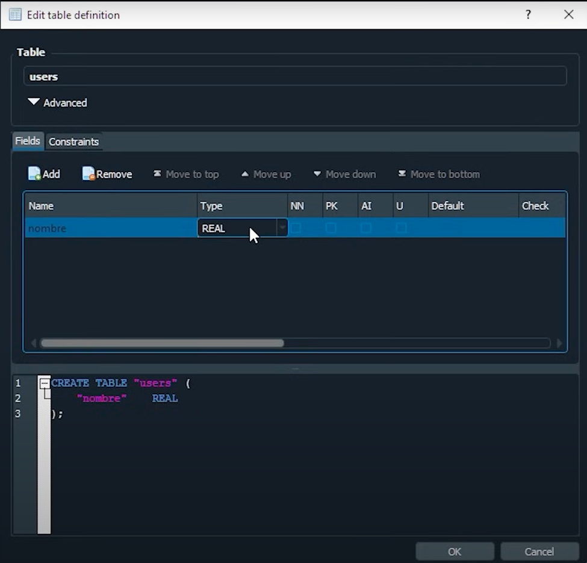
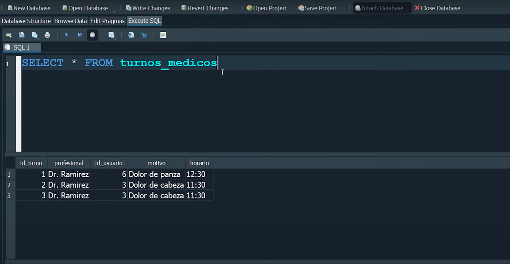
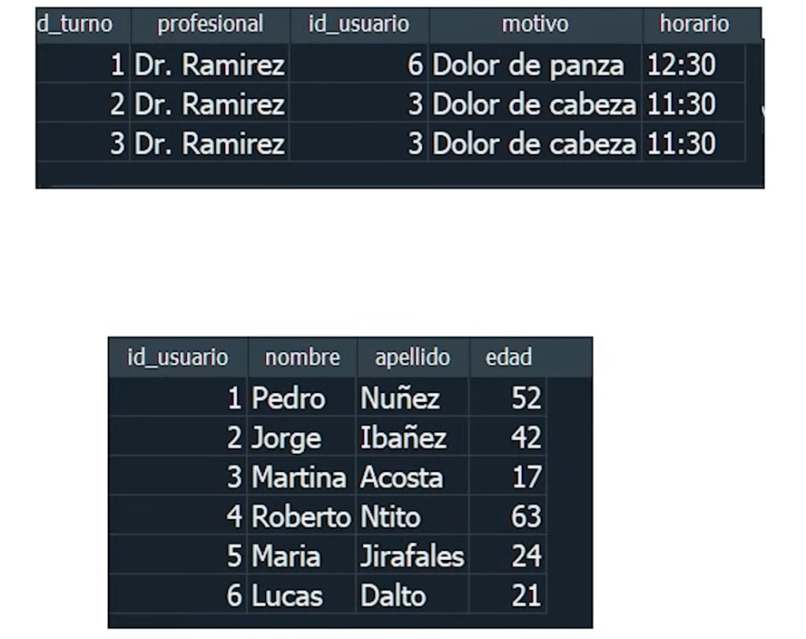

# --------------------
# TABLAS EN SQL:
# --------------------
- 

- Campo(columna en vertical):             Uno Dos Tres Cuatro

- Valor de campo: cada una de las casillas de las tablas.

- Registro(toda la fila en horizontal): Uno
                                        Dos
                                        Tres
                                        Cuatro

- TYPE: tipo de dato que va a ser el campo. Campo edad: número // Campo nombre: text
    -Integer: cualquier número. Int.
    -Text: cualquier tipo de texto.
    -BLOB: almacena datos binarios. (archivos, imágenes, vídeos...)
    -Real: para almacenar datos float, es decir, valores con comas y también porcentajes. (Menos info y capacidad pero más rápido)
    -Numeric: números enormes como los decimales de pi 3,14159...(Más info y más capacidad pero más lento)

Not Null (NN):
Primary key(PK): nos permite hacer referencia a cualquier registro sin tener valores duplicados. Van juntas PK y AI.
Foreign key (FK):  es una Primary key en otra tabla, que se muestra en una tabla diferente como un dato más.
Auto Increment (AI): es una propiedad que nos permite autoincrementar para que cada registro sea único. Van juntas PK y AI.
U:
Default: que tenga un valor por defecto / Check

## CONSULTAS/QUERY A UNA BASE DE DATOS:
- Todo el CRUD se considera consultas.
Select: es la sentencia que nos permite hacer preguntas. Nos devuelve tablas siempre.
*: selector universal de todo
FROM: de...
Usuarios: nombre de la tabla.

### Seleccionar todo de la tabla Users:
select * FROM usuarios //// No nos devuelve nada porque no hay nada guardado.

### Si queremos manipular datos debemos de insertar datos:
insert into usuarios (nombre, apellido, edad)
values  id_usuario 1 ('Jaime', 'Nebot', 27),
        id_usuario 2 ('Juan', 'López', 21),
        id_usuario 3 ('Pedro', 'Pérez', 34)

insert into usuarios (apellido, edad)
values  id_usuario 1 ('Nebot', 27),
        id_usuario 2 ('López', 21),
        id_usuario 3 ('Pérez', 34)

select * FROM usuarios //// el resultado es que nos ha guardado los 3 registros y siempre nos muestra en pantalla lo que hay en el paréntesis

# ---------------------
# IDENTIFICADORES:
# ---------------------
- Todo lo que sea un id (ejemplo: usuario_id, producto_id...) son autoincrementable.
- Es un campo que sirve para identificar un registro(fila) entero de forma única.
- Los identicadores primarios:
    -No pueden ser Null.

- Un ejemplo: citas médicas. id_turno (¿Qué día de las 7 visitas al médico viniste con un dolor de tripa? id_turno: 4ª cita) 
- Los identifiadores
id_usuario

- 

- 

En la captura 3, vemos cómo la información de la segunda tabla id_usuario la llevamos a la primera tabla pero sólo en una columna (id_usuario)

## ¿Cómo relacionar tablas?
Con las foreign keys, que vemos en la captura 3.png, conectando tablas entre sí.

