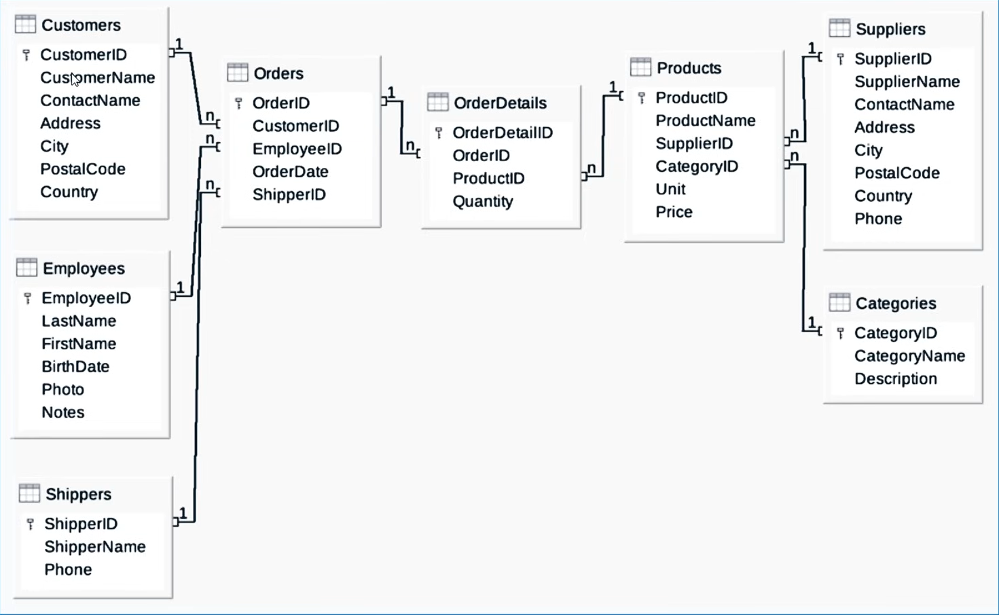
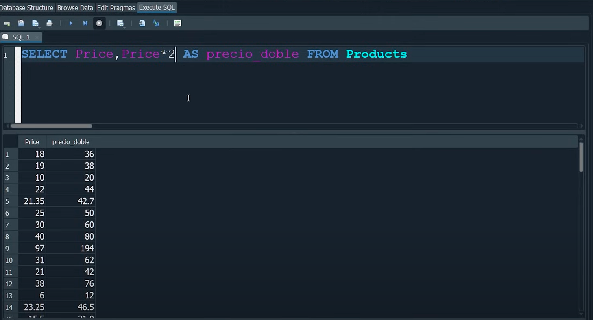

# -------------------------------
# EL CURSO DESCARGA: northwind
# -------------------------------
- Aparecen aquí los diagramas, que nos permite visualizar cómo se relacionan los datos.

- 

- Las que tienen un simbolito de llave es la clave, es el campo identificador que traslada todos los datos de la tabla a otras tablas. 
        - id_empleados. Con info en su interior.
        - id_clientes. Con info en su interior.
        - id_shippers. Con info en su interior.

Todas estas componen la tabla Orders, la principal.

## Para cambiar nombre, ponemos esto:
Select LastName AS apellido FROM usuarios

Nos dará una nueva tabla, cambiando el campo LastName por apellido

-  : ejemplo con precio y cambios de nombre en tablas.

## Para ordenar los datos, ponemos esto:
select * FROM Products
Order by price Asc or Desc //// Nos va a ordenar los productos por precio ASC (ascendente) o Desc (descendente)

select * FROM Products
Order by ProductName Asc or Desc //// EL valor más bajo es el Null, los números, caracteres especiales y las letras el más alto.

select * FROM Products
Order by ProductName Desc Nulls first /// Para que los nulls se vayan al fondo, porque por defecto aparecerán al principio.

select * FROM Products
Order by RANDOM () Nulls first or last //// Ordenar de forma aleatoria, no respeta los nulls

select * FROM Products
Order by ProductName, SupplierID Desc or Asc //// Ordenar por dos campos

## Para seleccionar los valores únicos (sin repeticiones ni duplicidades) de ProductName, ponemos esto:
select distinct ProductName
FROM Products Order by ProductName Asc