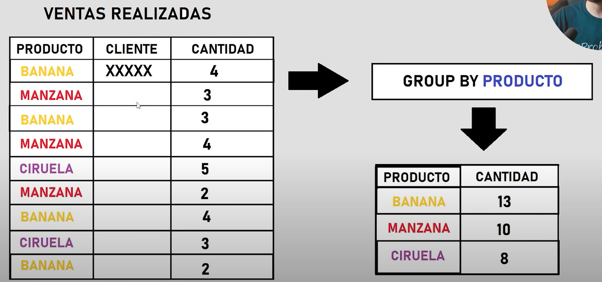
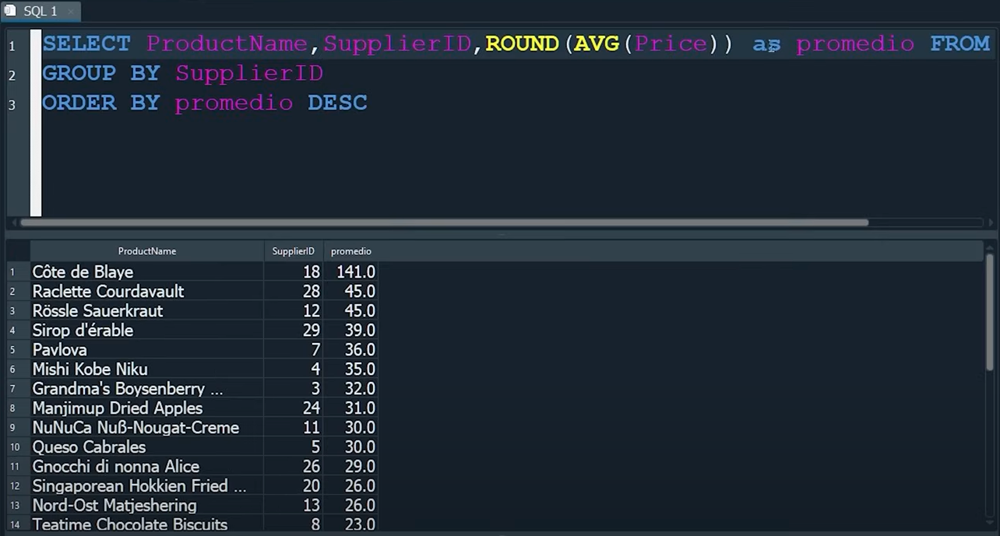
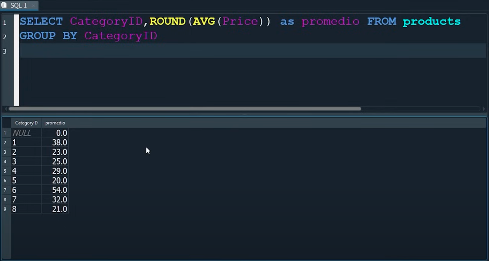

# SUBCONSULTAS:

## Funciones de agregación:
- Nos permite agrupar datos, resumirlos, trabajar con datos estadísticos...
- Se utilizan con la cláusula select.

```SQL
select * FROM Employees  // Me devuelve todo
select FirstName, LastName FROM Employees  // Me devuelve solo nombre y apellidos de la tabla Employees.

/// Quiero saber cuantos firstName hay en la tabla empleados
Select count(firstName) FROM Employees  // Nos devuelve por ejemplo 10, que es el número de empleados.


//Quiero sumar todos los precios de la tabla productos
Select  SUM (Price) FROM Products /// Nos devuelve la suma de todos.

//Quiero saber el promedio de todos los precios de la tabla productos
Select  AVG(Price) FROM Products /// Nos devuelve el promedio. (27,76433324€)

//Quiero saber el promedio de todos los precios de la tabla productos y que me lo redondee.
Select  ROUND(AVG(Price)) FROM Products /// Nos devuelve el promedio redondeado (28€)

//Quiero saber el promedio de todos los precios de la tabla productos, que me lo redondee con tres decimales.
Select  ROUND(AVG(Price), 3) FROM Products  /// Nos devuelve el promedio redondeado con tres decimales (27,764€)


// Quiero encontrar el precio MÍNIMO, sin que me aparezcan los nulos.
Select  ProductName, MIN(Price) FROM Products  /// Nos devuelve el precio mínimo
WHERE ProductName IS NOT NULL

// Quiero encontrar el precio MÁXIMO, sin que me aparezcan los nulos.
Select  ProductName, MAX(Price) FROM Products  /// Nos devuelve el precio máximo
WHERE ProductName IS NOT NULL
```

## CLÁUSULAS GROUP BY y HAVING:
- 
- 

- El HAVING es como un WHERE pero en vez de filtrar registros, lo que hace es filtrar GRUPOS.
- NO SE PUEDE MEZCLAR DOS VECES LA FUNCIÓN DE AGREGACIÓN. Una dentro de otra o que hagan referencia a otra función.
- El HAVING no puede utilizarse sin el GROUP BY.
- Orden correcto: Select... FROM /// WHERE /// Group By /// HAVING /// Order By /// LIMIT

```SQL
// Quiero saber el promedio de precios y agruparlos por proveedor.
Select  CategoryID, SupplierID, ROUND(AVG(Price)) AS promedio FROM Products 
WHERE CategoryID IS NOT NULL
Group By CategoryID
```


```SQL
// Quiero saber el promedio por categoría.
Select  CategoryID, ROUND(AVG(Price)) AS promedio FROM Products
Group By CategoryID 
````
Nos devuelve: 


// Quiero saber el promedio por proveedor y filtrando los nulos, para que el promedio no se desajuste.
Select  SupplierID, ROUND(AVG(Price)) AS promedio FROM Products
WHERE ProductName IS NOT NULL
Group By SupplierID 
HAVING promedio > 40  /// Nos va a devolver solo los valores en los que promedio sea menor a 40.

// Quiero saber cuantas veces se ha vendido un ProductID, que se agrupen y que se ordenen.
select ProductID, SUM(Quantity) AS Total FROM OrderDetails
Group By ProductID
Order By Total

// Quiero saber el producto más vendido.
select ProductID, SUM(Quantity) AS Total FROM OrderDetails
Group By ProductID
Order By Total Desc
LIMIT 1 /// Al limitar, solo nos devolverá el primero, es decir, el más vendido.

// Quiero saber el producto menos vendido.
select ProductID, SUM(Quantity) AS Total FROM OrderDetails
Group By ProductID
Order By Total Asc
LIMIT 1 /// Al limitar, solo nos devolverá el primero, es decir, el menos vendido.

// Quiero saber cuantas veces se ha vendido un ProductID, que se agrupen y que se ordenen. También quiero descartar los productos que se han vendido menos de 50 veces y eliminarlos
select ProductID, SUM(Quantity) AS Total FROM OrderDetails
Group By ProductID
HAVING total < 50
Order By Total
```
