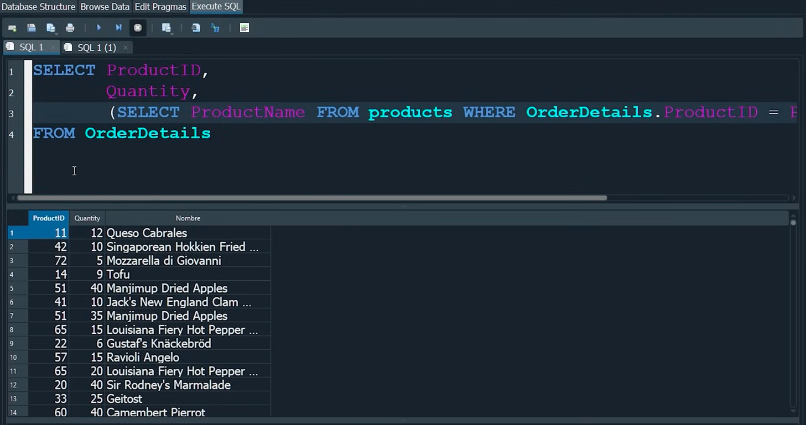
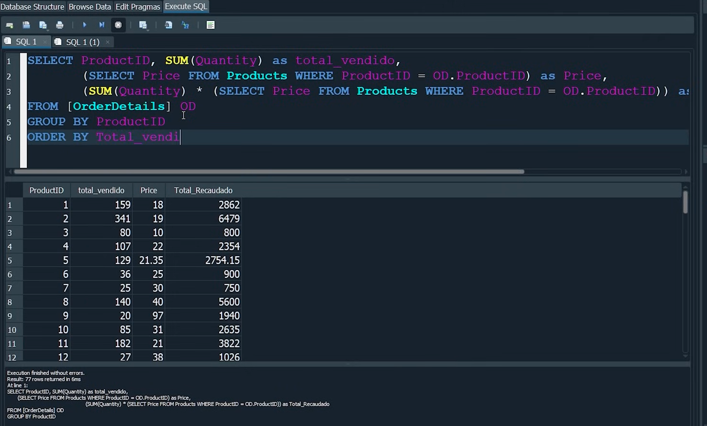
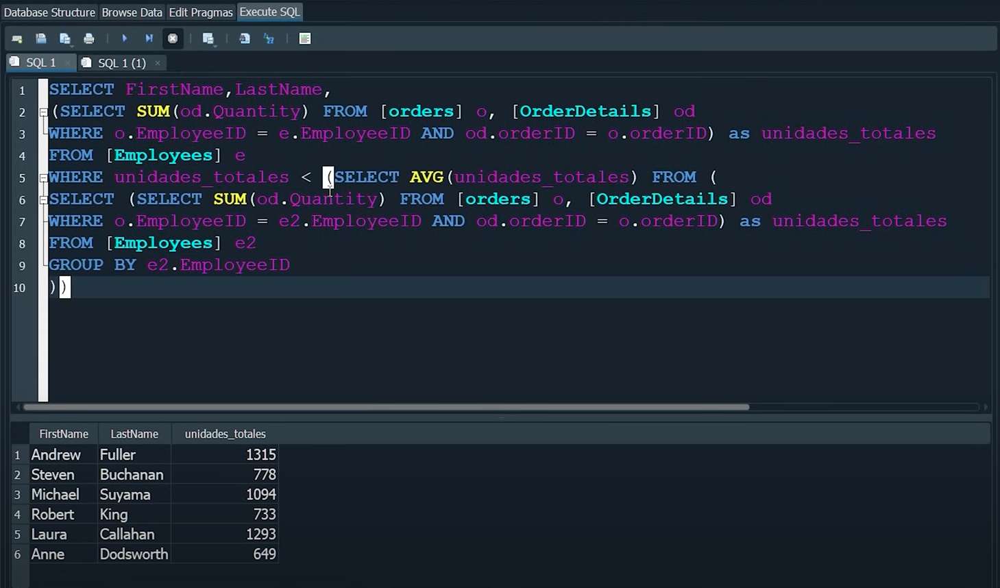

# ----------------
# SUBCONSULTAS:
# ----------------
- Para hablar de las subconsultas debemos entender que estamos en el apartado de las tablas relacionales.
- Relacionamos tablas y sus datos utilizando identificadores.
- Definición: es una consulta que está dentro de otra consulta. Sirven para hacer constultas más avanzadas, es decir, ejecutar una subconsulta y, con sus resultados, ejecutar otra consulta. Filtrar y encontrar datos mejor.
- Las subconsultas suelen ser con select, porque ni modifican ni agregan nada a la base de datos, solo la consultan.

## Cómo saber el nombre y el precio de un ProductName, de un ProductID, y saber la cantidad total de una table products:
- 

```SQL
select  ProductID,
        Quantity, 
        (select ProductName FROM products WHERE OD.ProductID = ProductID) AS Nombre,     ///// Esto es una subconsulta.
        (select Price FROM products WHERE OD.ProductID = ProductID) AS Precio
FROM OrderDetails AS OD

*Truco: el AS y los corchetes hacen lo mismo (OrderDetails AS OD, es exactamente igual a poner [OrderDetails]).
```

## Aquí miramos el ProductID, el total vendido de ese producto, cuál es el precio de cada producto, su nombre y el total recaudado por las ventas de ese producto:
- 

```SQL
select ProductID, SUM(Quantity) AS total_vendido FROM OrderDetails,
        (select Price FROM Products WHERE ProductID = OD.ProductID), AS Price,
        round ((SUM (Quantity) * (select Price FROM Products WHERE ProductID = OD.ProductID))), AS Total_Recaudado,
FROM [OrderDetails] OD
Group By ProductID
```

# ---------------------------------
# EJERCICIO PRÁCTICO SUBCONSULTAS:
# ---------------------------------
- 
- Queremos saber qué empleados han sido mejores y han destacado del promedio en ventas.
```SQL
select FirstName, LastName,  //// Estamos seleccionando nombre y apellido de los empleados
(select SUM(od.Quantity) FROM [orders] o , [OrderDetails] OD //// Estamos seleccionando promedio de unidades vendidas
WHERE o.EmployeeID = e.EmployeeID AND od.orderID = o.orderID) AS unidades_totales
FROM [Employees] e  //// Todo lo seleccionamos de la tabla empleados

WHERE unidades_totales < (select AVG(unidades_totales) FROM (
select (select SUM(od.Quantity) FROM [orders] o , [OrderDetails] OD
WHERE o.EmployeeID = e2.EmployeeID AND od.orderID = o.orderID) AS unidades_totales)  FROM [Employees] e2
Group by e2.EmployeeID
) 

**NOS QUEDAMOS EN EL MINUTO 4:39:15 - JOINS
https://www.youtube.com/watch?v=DFg1V-rO6Pg 


